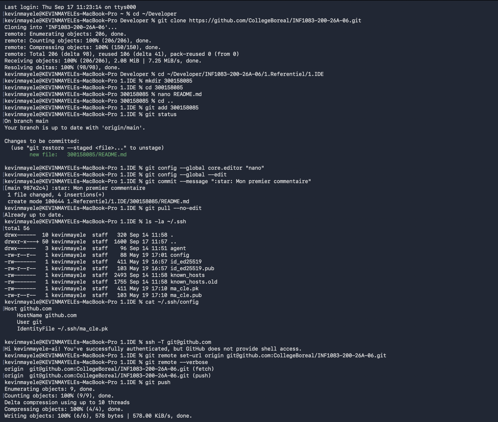
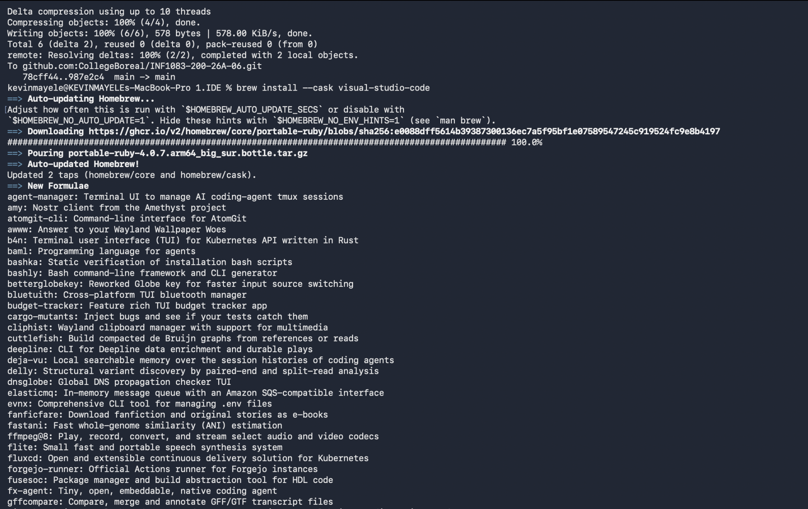
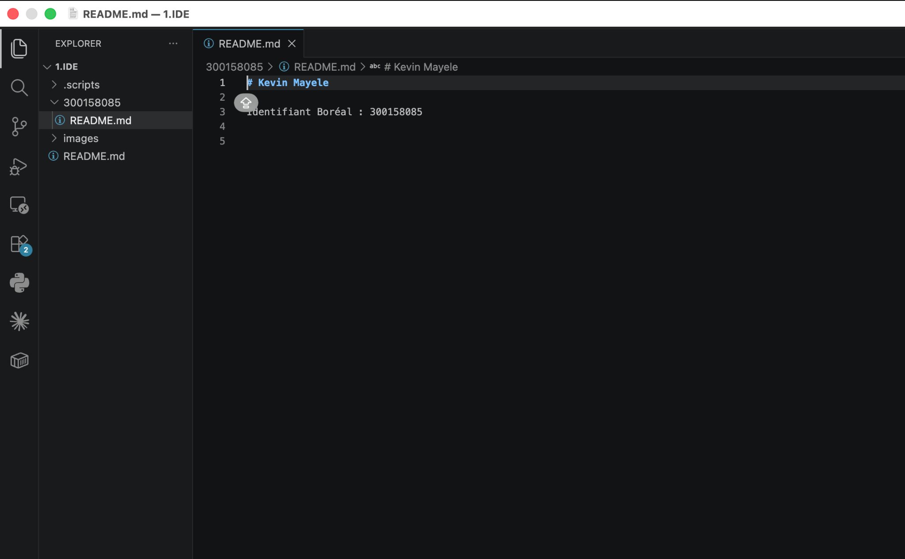

# Configuration de Git, SSH et Visual Studio Code

**Nom :** Kevin Mayele  
**Identifiant Boréal :** 300158085  
**Cours :** INF1083

## 1. Préparation du dépôt et premier commit

J’ai cloné le dépôt du cours dans le dossier `Developer` de mon Mac. Dans le répertoire `1.Referentiel/1.IDE`, j’ai créé mon dossier `300158085` et un fichier `README.md` contenant mon nom et mon identifiant.

J’ai ajouté mon dossier avec `git add`, puis créé le commit `987e2c4` avec le commentaire « :star: Mon premier commentaire ». La commande `git pull --no-edit` a indiqué que mon dépôt était à jour.

## 2. Vérification de la connexion SSH

Les fichiers de clés SSH étaient déjà présents sur mon Mac. J’ai vérifié que le fichier `~/.ssh/config` utilisait `ma_cle.pk` pour la connexion à `github.com`.

Le test `ssh -T git@github.com` a réussi : GitHub m’a reconnu avec le compte `kevinmayele-ai`. J’ai ensuite changé l’adresse du dépôt distant pour utiliser SSH.

## 3. Envoi du travail sur GitHub

J’ai exécuté `git push` pour envoyer mon travail dans le dépôt du cours. Le résultat `78cff44..987e2c4 main -> main` confirme l’envoi de mon commit sur la branche `main`.

J’ai ensuite lancé la commande d’installation de Visual Studio Code avec Homebrew. L’application étant déjà présente sur mon Mac, Homebrew a arrêté l’installation.

## 4. Ouverture dans Visual Studio Code

J’ai ouvert le dossier de la leçon dans Visual Studio Code, puis mon fichier `300158085/README.md`. Mon nom et mon identifiant Boréal apparaissent dans l’éditeur.

