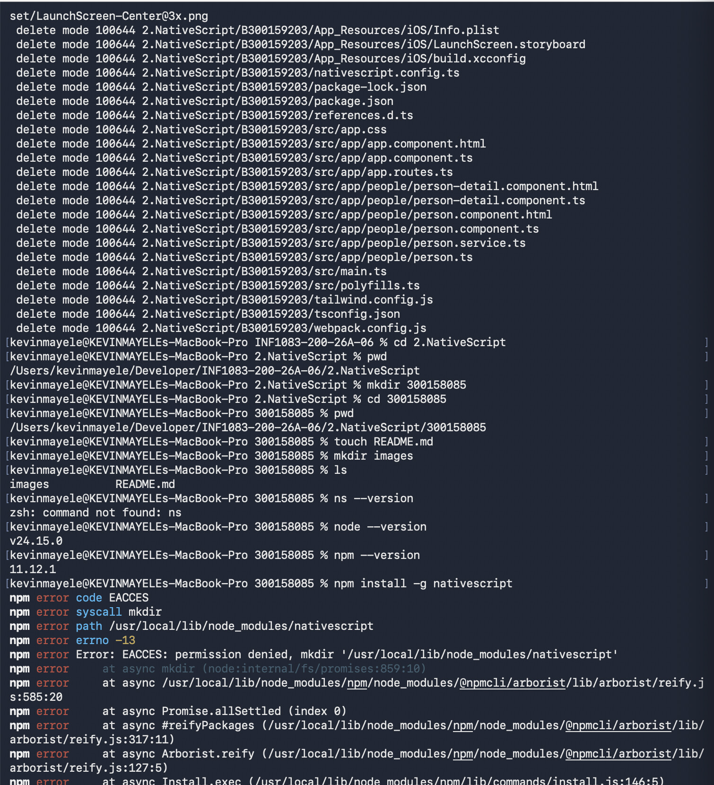
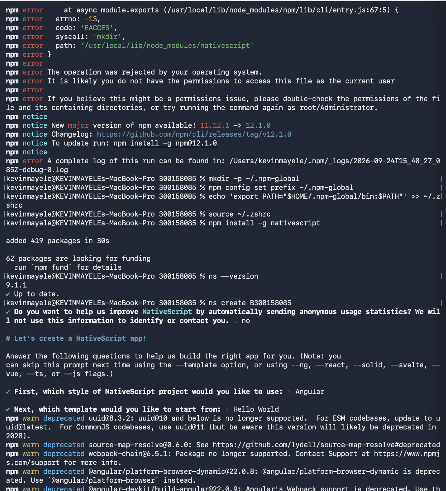
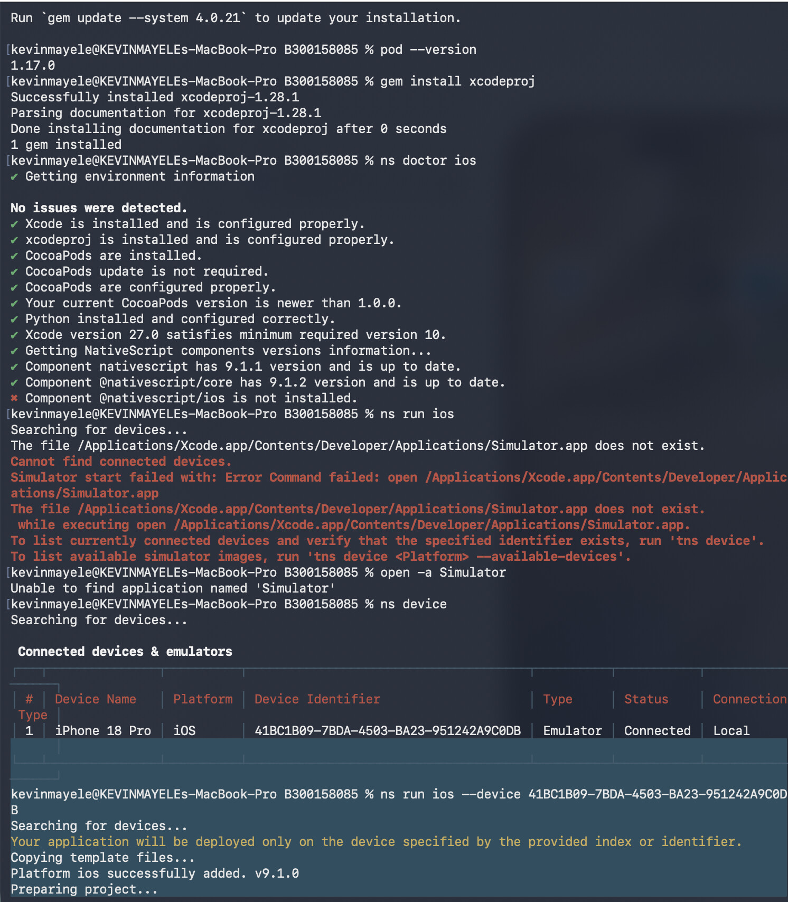
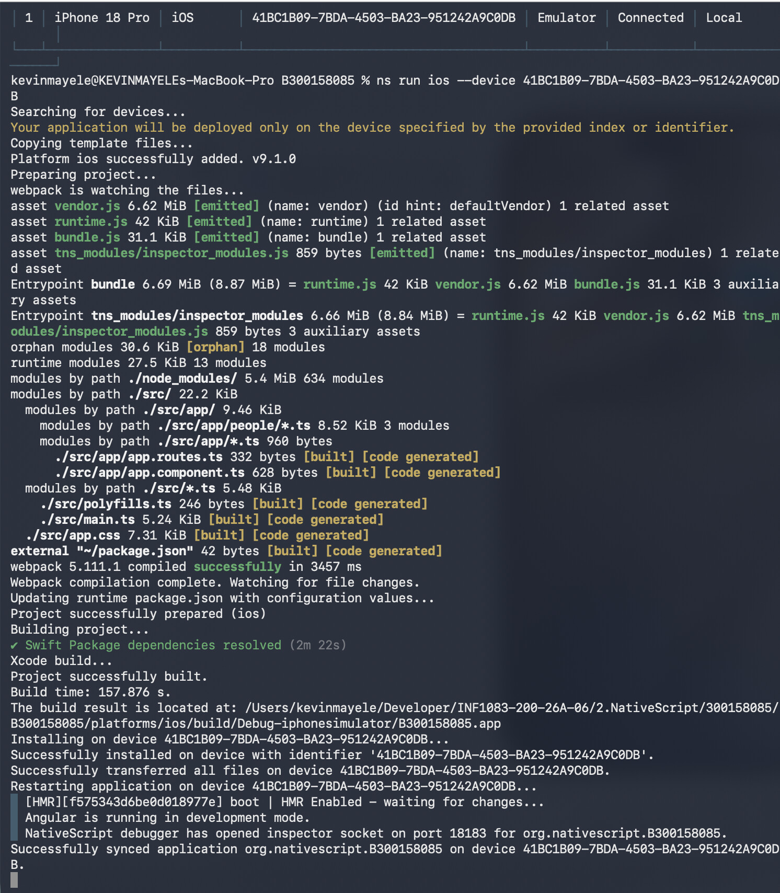
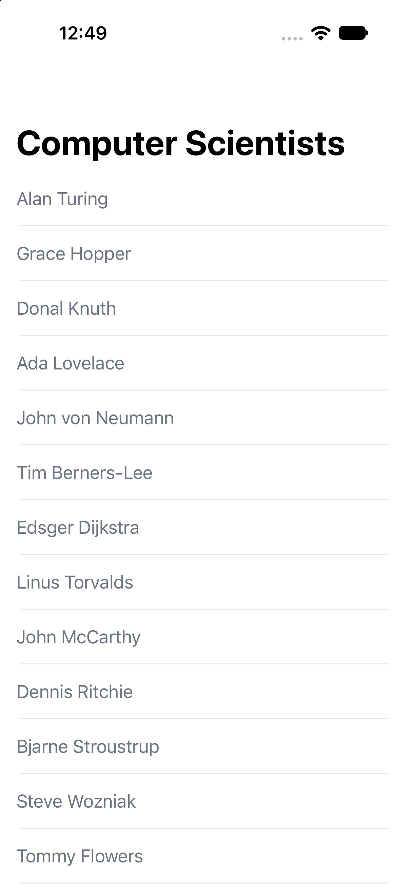
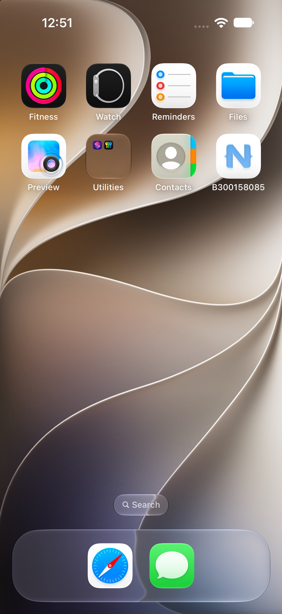

# Première application NativeScript

**Nom :** Kevin Mayele  
**Numéro étudiant :** 300158085  
**Projet :** B300158085  
**Plateforme utilisée :** iOS  

## 1. Création du dossier de travail

J’ai commencé par ouvrir le dépôt du cours et me déplacer dans le dossier `2.NativeScript`.

J’ai ensuite créé mon dossier étudiant `300158085`, le fichier `README.md` et le dossier `images`.

```bash
mkdir 300158085
cd 300158085
touch README.md
mkdir images
```

Au début, la commande `ns` n’était pas reconnue par mon Terminal. J’ai vérifié que Node.js et npm étaient déjà installés avant de poursuivre.



## 2. Installation de NativeScript

La première installation globale de NativeScript a échoué avec une erreur de permission `EACCES`.

Pour résoudre ce problème, j’ai créé un dossier npm dans mon répertoire personnel et ajouté ce dossier dans la variable `PATH`.

```bash
mkdir -p ~/.npm-global
npm config set prefix ~/.npm-global
echo 'export PATH="$HOME/.npm-global/bin:$PATH"' >> ~/.zshrc
source ~/.zshrc
npm install -g nativescript
```

J’ai ensuite vérifié l’installation :

```bash
ns --version
```

NativeScript `9.1.1` a été installé correctement.

Après l’installation, j’ai créé le projet demandé :

```bash
ns create B300158085
```

J’ai choisi les options suivantes :

- Angular
- Hello World



## 3. Configuration de l’environnement iOS

Comme j’utilise un Mac, j’ai choisi d’exécuter le projet sur iOS.

J’ai vérifié la configuration avec la commande suivante :

```bash
ns doctor ios
```

Le premier diagnostic indiquait que certains composants nécessaires n’étaient pas correctement configurés. J’ai donc vérifié et configuré les éléments suivants :

- Xcode
- Ruby
- CocoaPods
- xcodeproj
- NativeScript iOS

Après la configuration, `ns doctor ios` a confirmé qu’aucun problème n’avait été détecté.

Avec Xcode 27, l’application `Simulator` n’était pas disponible à son ancien emplacement. J’ai donc utilisé **Device Hub** pour créer un appareil virtuel **iPhone 18 Pro sous iOS 27.0**.

J’ai ensuite vérifié la connexion de l’appareil avec :

```bash
ns device
```



## 4. Exécution de l’application

Après avoir confirmé que l’iPhone virtuel était connecté, j’ai exécuté le projet sur cet appareil.

```bash
cd B300158085
ns run ios --device 41BC1B09-7BDA-4503-BA23-951242A9C0DB
```

NativeScript a préparé le projet, compilé l’application, installé celle-ci sur l’iPhone virtuel et synchronisé les fichiers.

Les messages suivants ont confirmé la réussite de l’exécution :

- `Project successfully built`
- `Successfully installed`
- `Successfully transferred all files`
- `Successfully synced application`



## 5. Résultat final

L’application `B300158085` s’est ouverte correctement sur l’iPhone 18 Pro virtuel. L’écran principal affiche la liste « Computer Scientists » du modèle Hello World de NativeScript avec Angular.



L’icône de l’application `B300158085` est également visible sur l’écran d’accueil de l’iPhone virtuel.



## Difficultés rencontrées

Pendant ce travail, j’ai rencontré plusieurs difficultés :

1. La commande `ns` n’était pas reconnue.
2. L’installation globale de NativeScript a produit une erreur de permission `EACCES`.
3. Xcode, CocoaPods et `xcodeproj` devaient être configurés pour iOS.
4. NativeScript cherchait l’ancienne application `Simulator`, qui n’existe plus au même emplacement dans Xcode 27.
5. J’ai utilisé Device Hub pour créer et connecter manuellement un iPhone 18 Pro virtuel.

J’ai réussi à résoudre ces difficultés et à exécuter correctement ma première application NativeScript sur iOS.

