# B300159195 — Application NativeScript Angular sur Android

**Étudiant :** Islem Touadjni  
**Projet :** B300159195  
**Environnement :** Windows, VS Code, NativeScript avec Angular, Android Studio et téléphone Samsung connecté en USB.

## Objectif

Créer une application Android NativeScript, remplacer la liste d’exemple par quinze personnes aux noms arabes transcrits en français, associer à chaque personne un pays africain et une profession ou une ville, puis vérifier le résultat sur le téléphone. Ce journal présente les captures dans l’ordre du travail ; le texte placé sous chaque image décrit exactement l’étape correspondante.

## Réalisation et résolution des problèmes

### 01. Installation de Node.js

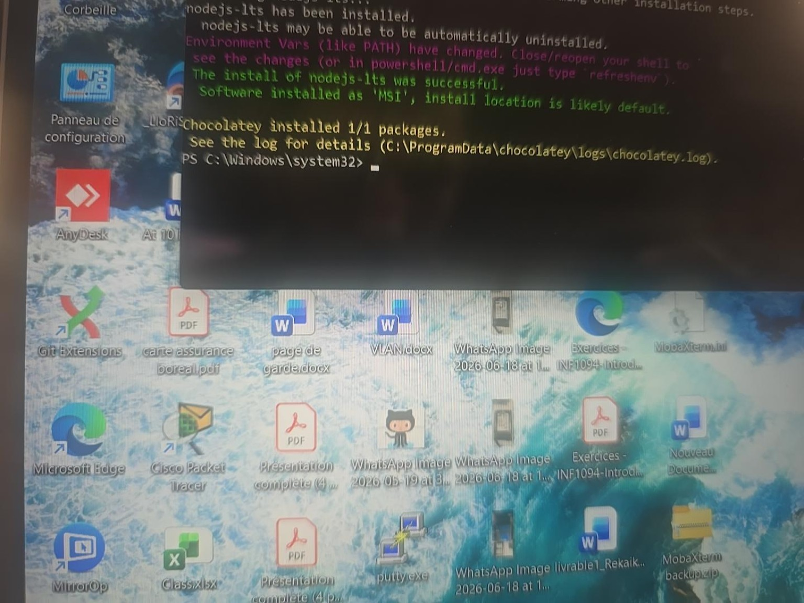

Installation de Node.js LTS avec Chocolatey sous Windows. Le terminal confirme que le paquet `nodejs-lts` a été installé. Après cette installation, une nouvelle session de terminal permet de prendre en compte les changements du `PATH`.

### 02. Installation de la CLI NativeScript

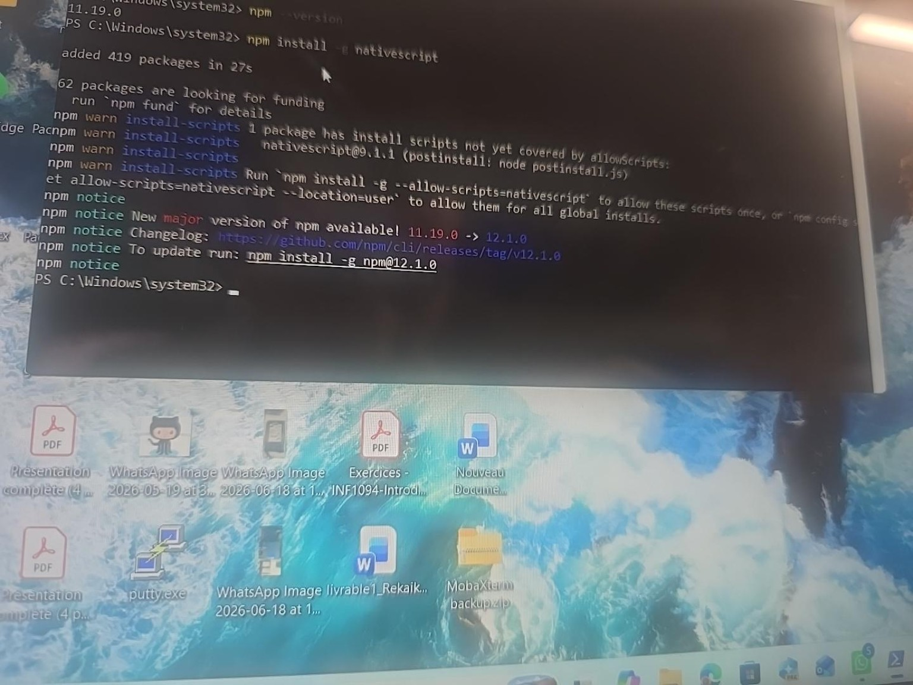

La commande `npm install -g nativescript` installe l’outil de création et d’exécution des projets NativeScript. Le message concernant les scripts npm est un avertissement ; l’installation des paquets s’est terminée.

```powershell
npm --version
npm install -g nativescript
```

### 03. Vérification et diagnostic

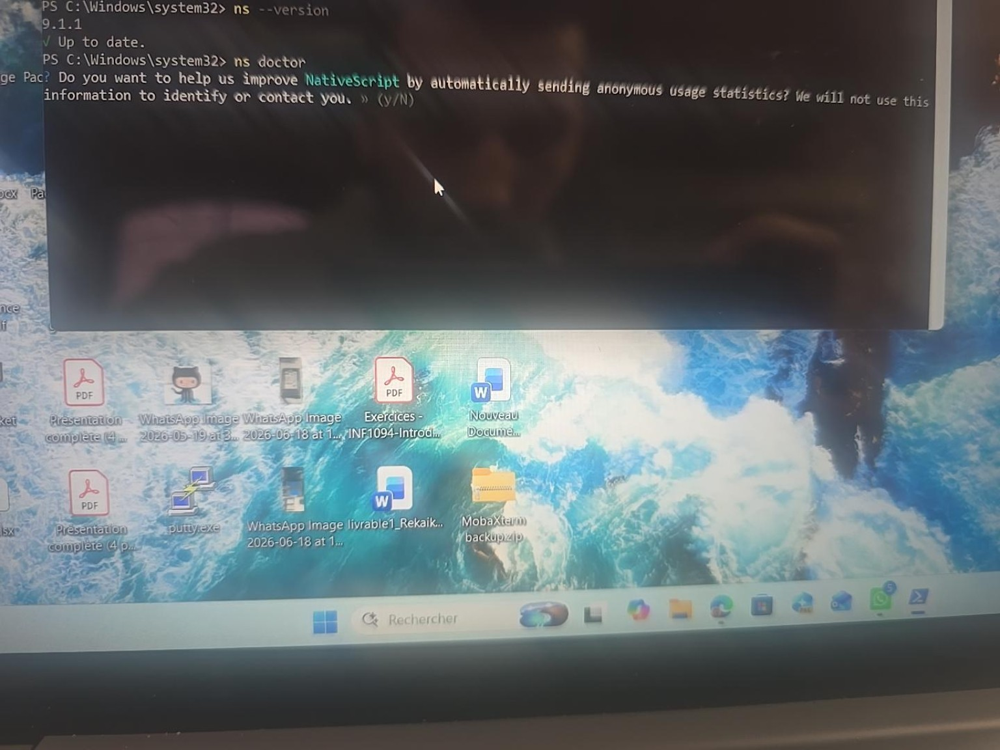

`ns --version` affiche la version 9.1.1. `ns doctor` lance ensuite le contrôle des prérequis ; il demande si l’on accepte l’envoi de statistiques anonymes.

```powershell
ns --version
ns doctor
```

### 04. Premier diagnostic : prérequis manquants

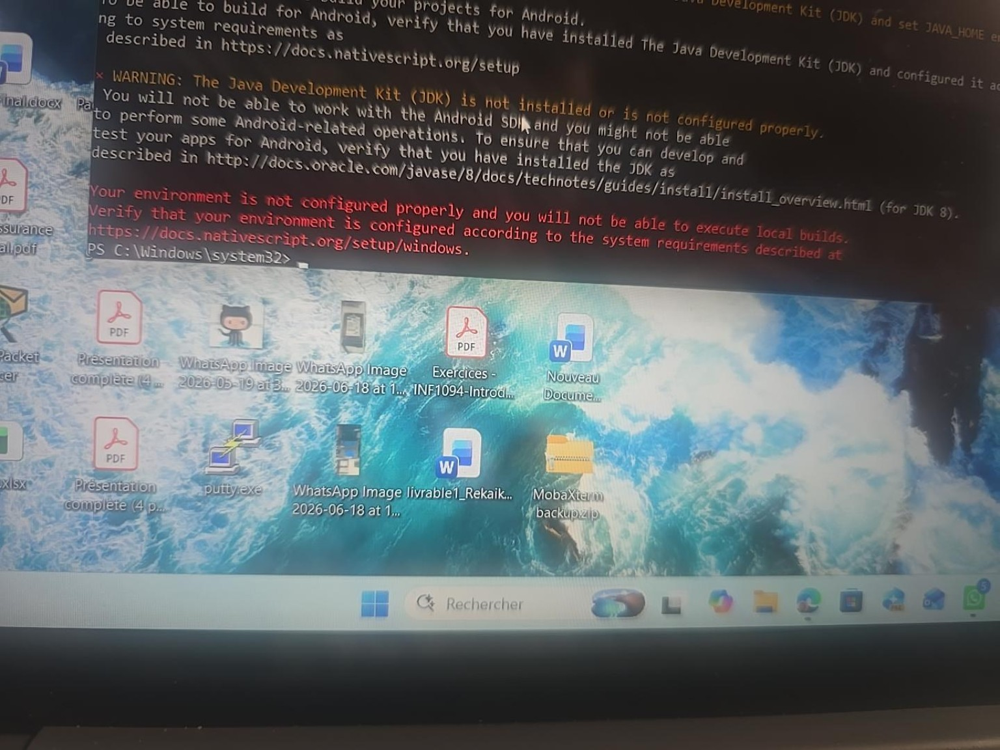

Le diagnostic indique qu’`ANDROID_HOME` ne pointe pas encore vers un SDK utilisable, que `adb`, les plateformes et les Build-Tools Android manquent, et que la commande `javac` ne fonctionne pas. Le projet ne peut donc pas encore être compilé pour Android.

### 05. Téléchargement d’Android Studio

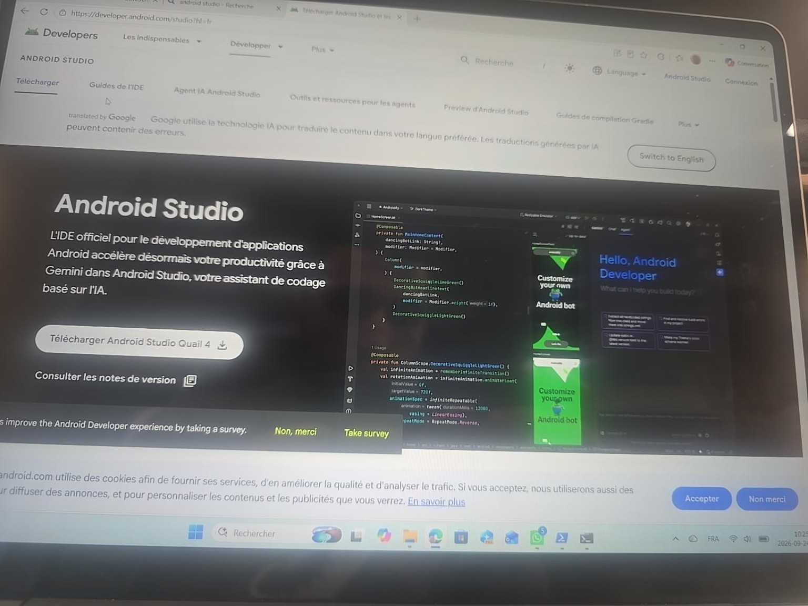

Ouverture du site de téléchargement d’Android Studio pour installer les outils Android nécessaires au projet : SDK, plateformes et outils de compilation.

### 06. Création du projet Angular

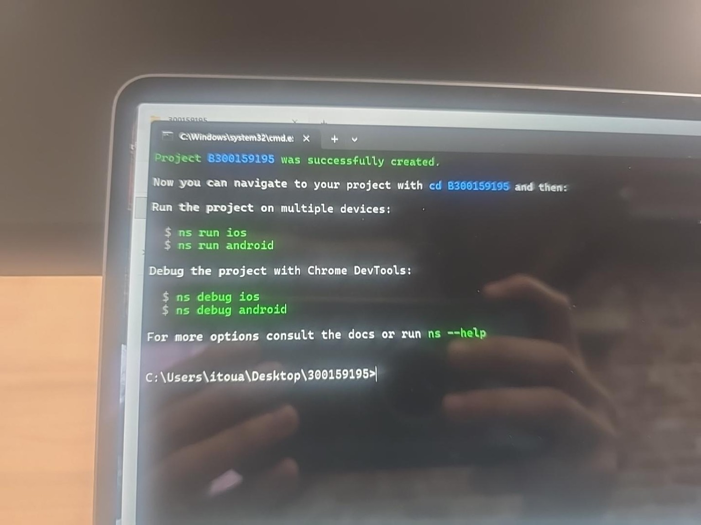

Depuis le dossier de travail sur le Bureau, la commande `ns create B300159195` lance la création du projet. Le modèle **Angular** a été choisi dans le menu interactif.

```cmd
ns create B300159195
```

### 07. Confirmation de la création

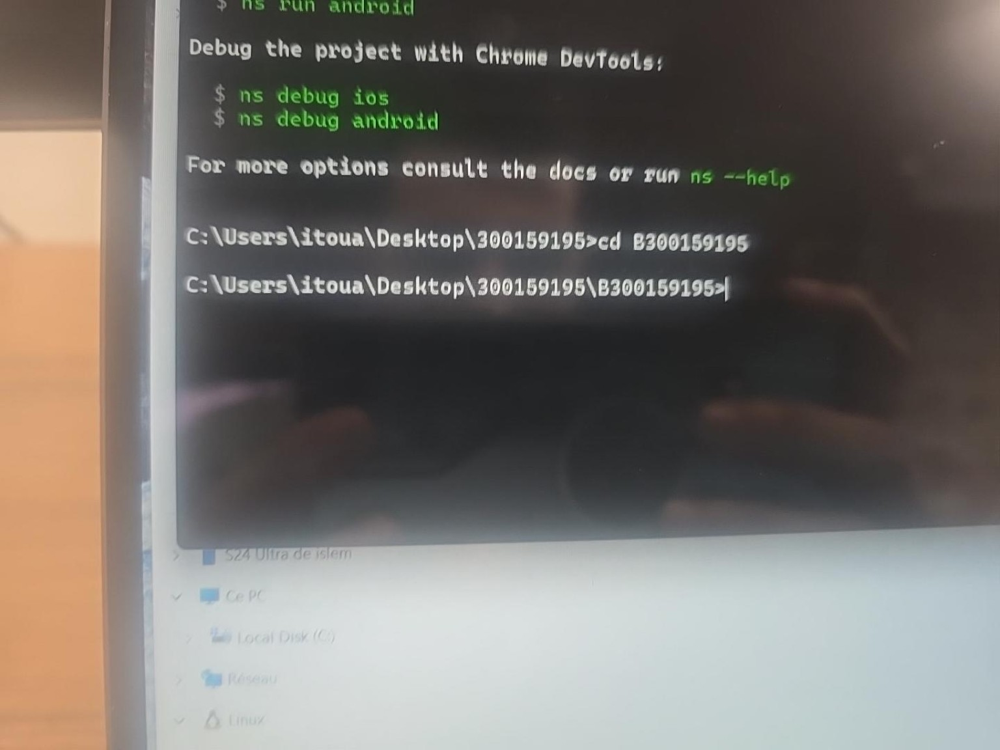

Le terminal affiche « Project B300159195 was successfully created ». Il propose ensuite `ns run android` pour Android. Ce message confirme seulement la création des fichiers, pas encore le fonctionnement sur un appareil.

### 08. Accès au projet


Une fois le projet créé, on entre dans son répertoire avant de lancer les commandes NativeScript.

```cmd
cd B300159195
```

### 09. Obstacle : émulateur incompatible

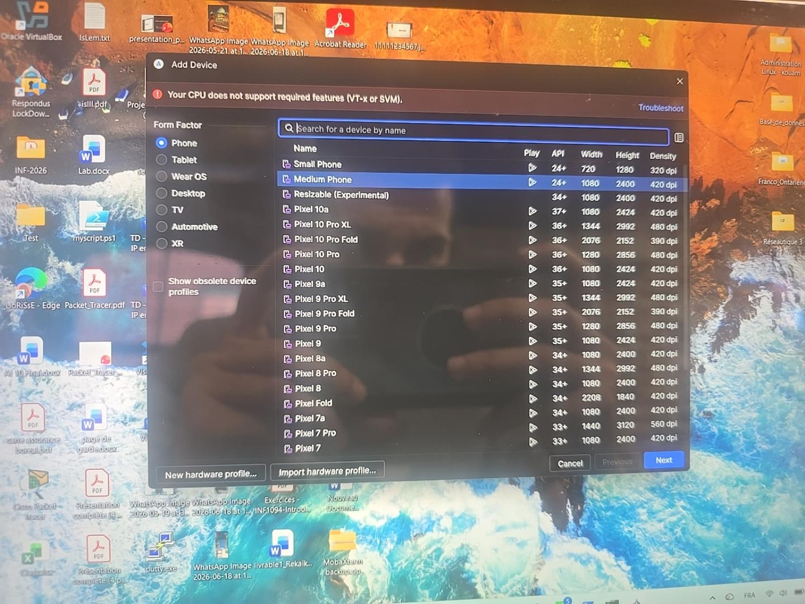

Dans Android Studio, la création d’un appareil virtuel affiche « Your CPU does not support required features (VT-x or SVM) ». Nous avons donc utilisé un téléphone Android physique pour les essais. Ce message seul ne démontre pas que la virtualisation est désactivée dans Windows.

### 10. Installation et vérification des outils Android

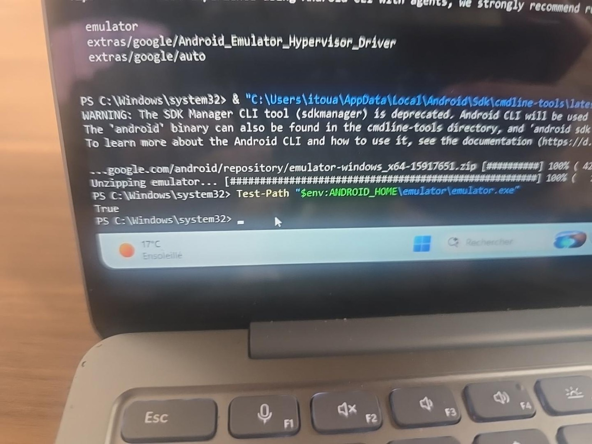

`sdkmanager` télécharge et décompresse l’émulateur. Le contrôle `Test-Path` renvoie `True` : le fichier existe, même si l’appareil virtuel demeure inutilisable sur cette machine. La mention « deprecated » de `sdkmanager` est un avertissement.

```powershell
Test-Path "$env:ANDROID_HOME\emulator\emulator.exe"
```

### 11. Activation du débogage USB sur le téléphone

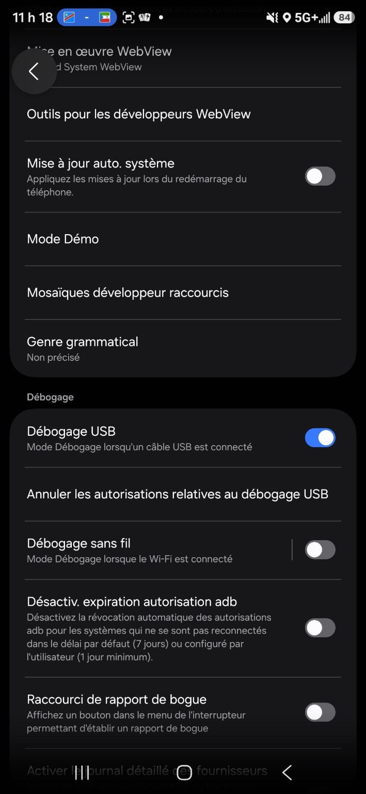

Dans les options développeur du téléphone Samsung, **Débogage USB** est activé afin que l’ordinateur puisse communiquer avec lui via ADB. Le téléphone est relié au PC par câble USB et l’autorisation de débogage est accordée sur le téléphone.

### 12. Vérification de la connexion ADB

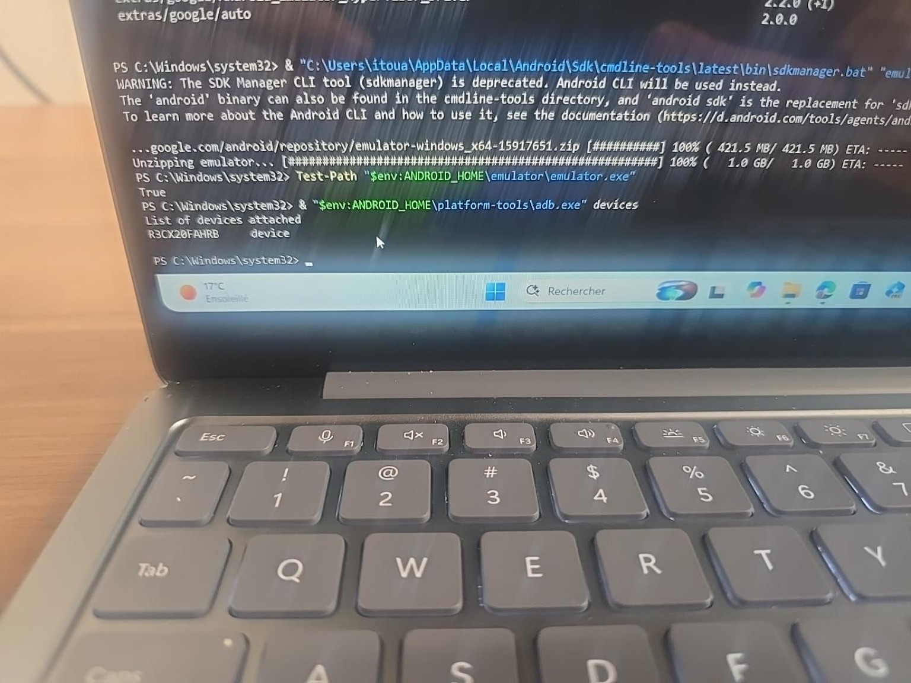

La commande ADB affiche un appareil avec l’état `device` (`R3CX20FAHRB`) : le téléphone est prêt à recevoir l’application. Ici `&` est l’opérateur d’exécution de PowerShell pour lancer un programme dont le chemin est entre guillemets.

```powershell
& "$env:ANDROID_HOME\platform-tools\adb.exe" devices
```

### 13. Premier échec de compilation avec Java

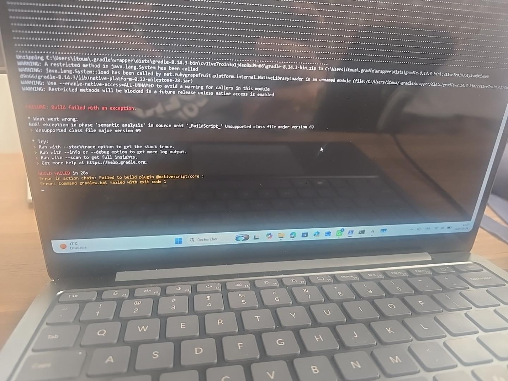

Le premier lancement Android échoue pendant la compilation Gradle. Le journal mentionne « Unsupported class file major version 69 » : la version de Java alors sélectionnée n’est pas compatible avec cette chaîne de compilation.

```powershell
ns run android
```

### 14. Correction : installation du JDK 21

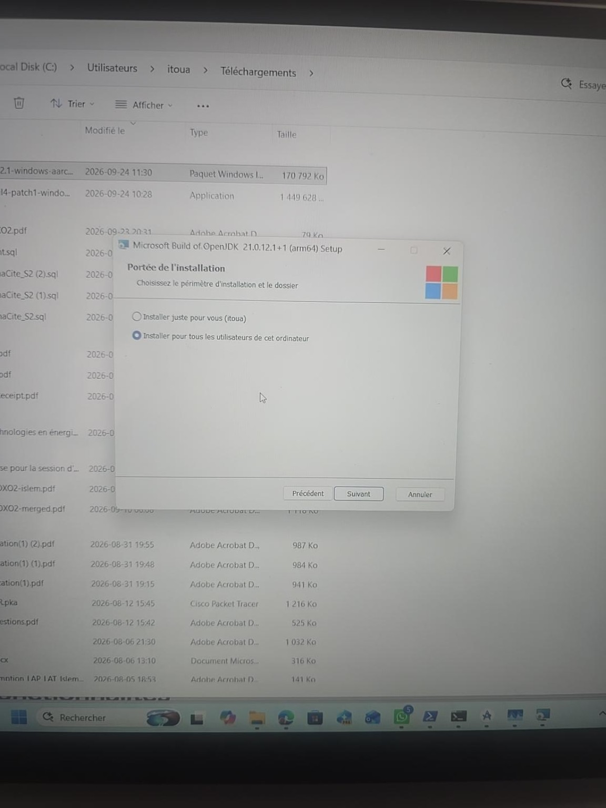

Installation de **Microsoft Build of OpenJDK 21**, version ARM64 adaptée à la machine. Il faut ensuite faire pointer `JAVA_HOME` vers ce JDK et placer son dossier `bin` dans le `PATH` du terminal. Le chemin exact dépend de l’installation Windows.

### 15. Contrôle de Java et nouvelle exécution

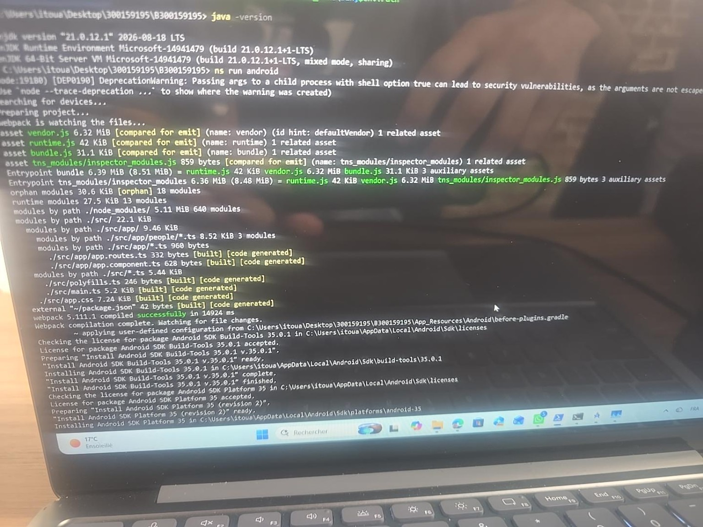

`java -version` confirme Java 21. Une nouvelle commande `ns run android` démarre la recherche du téléphone et prépare le projet. Si PowerShell conserve l’ancienne version, ouvrir un nouveau terminal après avoir configuré `JAVA_HOME`.

```powershell
java -version
ns run android
```

### 16. Dialogue du pare-feu Windows

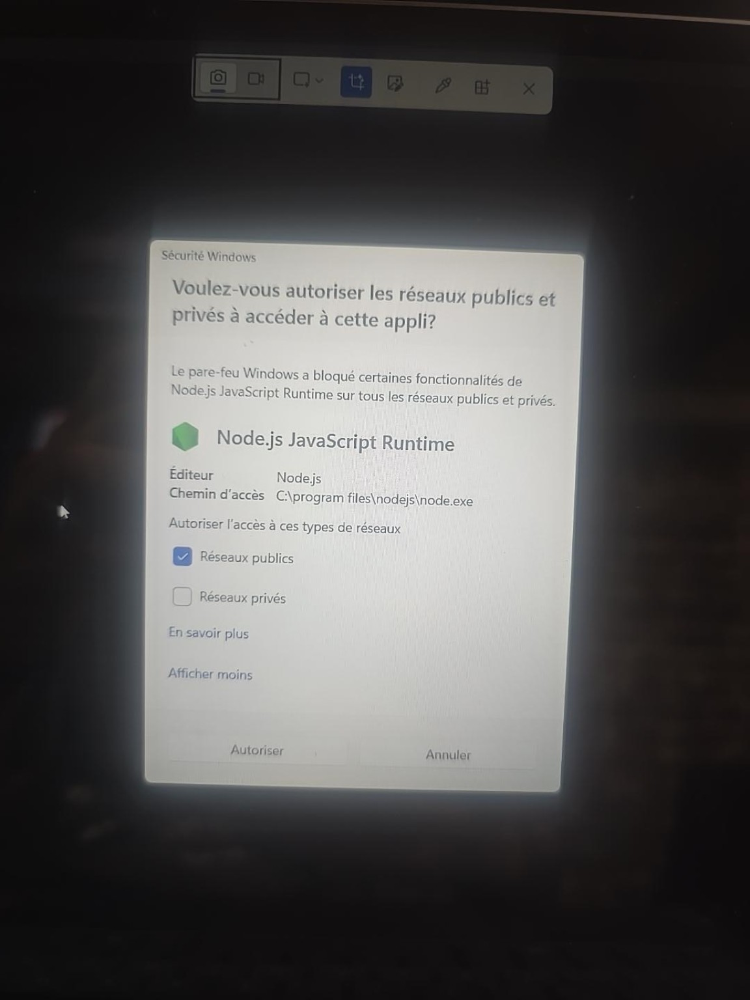

Au lancement du serveur de développement, Windows affiche une demande d’accès réseau pour Node.js. Cette boîte de dialogue appartient au pare-feu Windows ; elle apparaît pendant l’exécution du projet. La capture ne permet pas de déterminer quel choix a finalement été validé.

### 17. Installation des composants Android et compilation

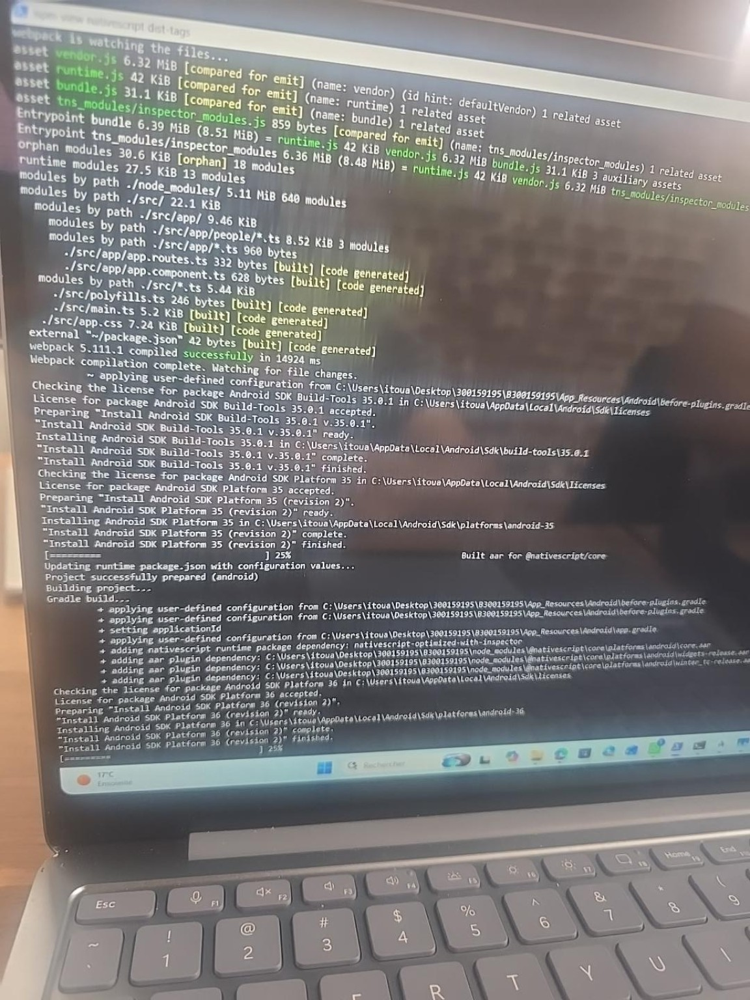

Webpack compile les fichiers Angular et NativeScript surveille les changements. La console installe automatiquement les Build-Tools 35.0.1 ainsi que les plateformes Android nécessaires ; Gradle construit ensuite l’application.

### 18. Succès : application installée sur le téléphone

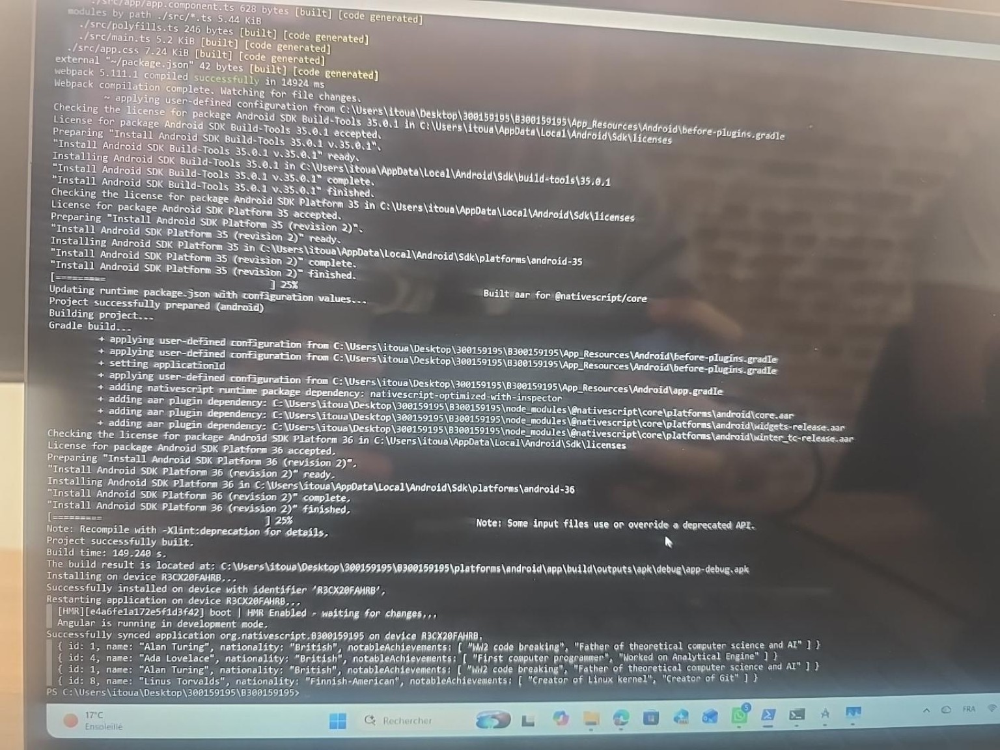

Le terminal affiche « Project successfully built », puis installe l’APK sur `R3CX20FAHRB` et synchronise `org.nativescript.B300159195`. C’est la preuve de la compilation et de l’exécution sur un vrai appareil.

### 19. État initial de l’application

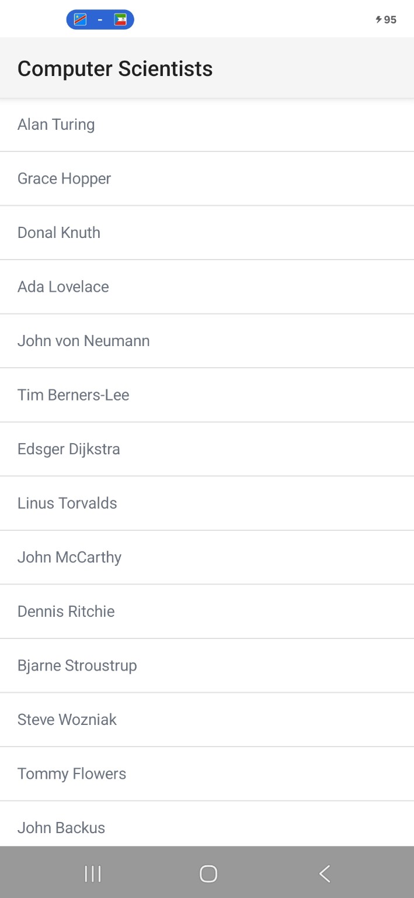

L’application NativeScript créée avec le modèle Angular affiche la liste initiale « Computer Scientists » : Alan Turing, Grace Hopper, etc. Cette capture sert de référence avant notre modification.

### 20. Fichier contenant les données affichées

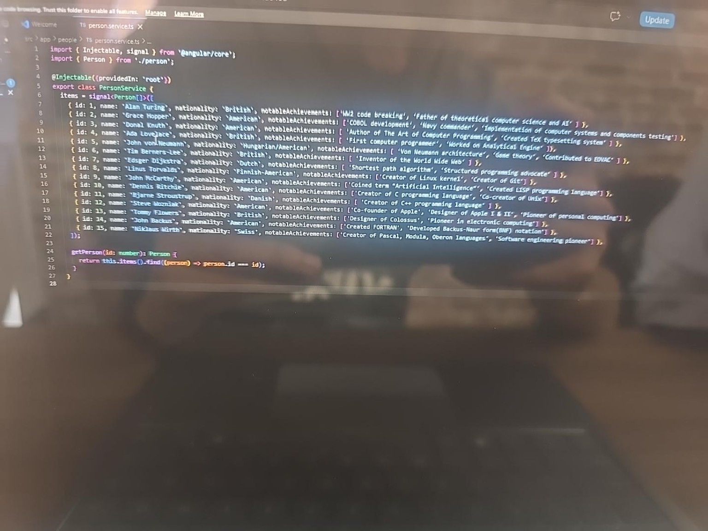

Dans VS Code, le fichier `src/app/people/person.service.ts` contient `items = signal<Person[]>(...)`, la liste des objets `Person`, ainsi que `getPerson(id)`. Les champs sont `id`, `name`, `nationality` et `notableAchievements`. La vue de l’application affiche les valeurs de `name`.

### 21. Première modification : noms en caractères arabes

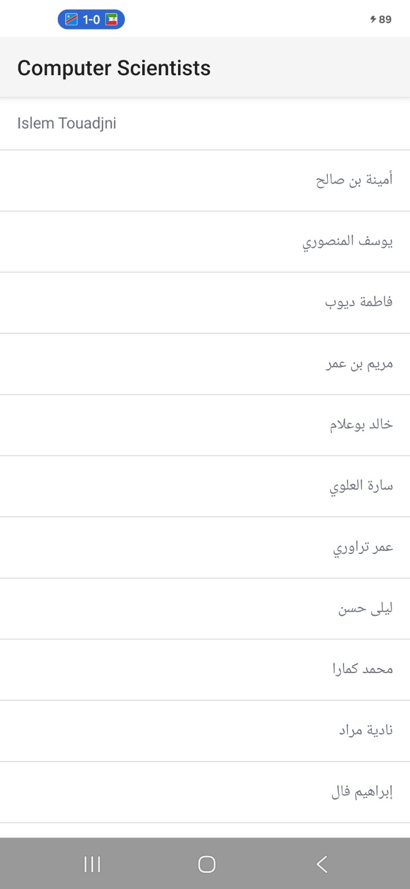

Les quinze personnes de la liste sont remplacées par des personnes et lieux africains ; les métiers sont renseignés dans `notableAchievements`. La première version utilise l’écriture arabe pour plusieurs noms. Le modèle garde le titre « Computer Scientists ».

### 22. Correction de l’écriture des noms

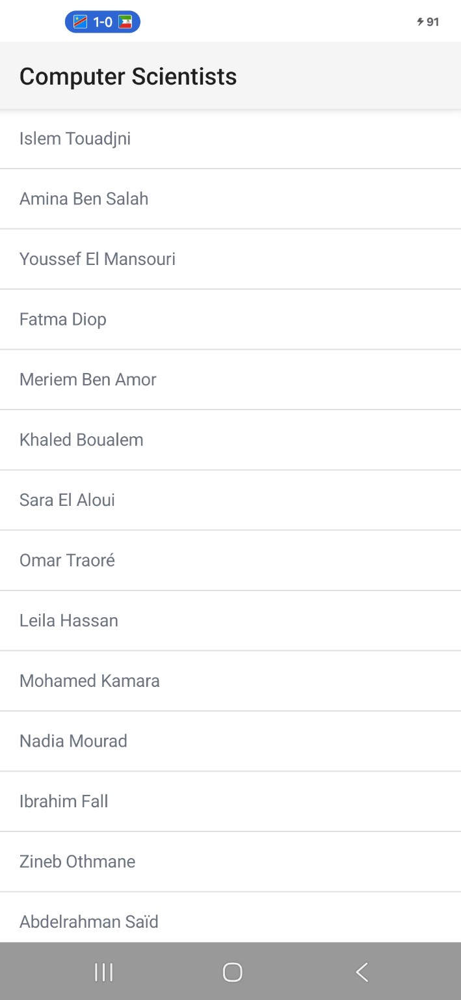

Les noms sont ensuite écrits en caractères latins selon l’usage français, comme **Islem Touadjni**, **Amina Ben Salah** et **Youssef El Mansouri**. Les quinze entrées restent dans `person.service.ts`. L’enregistrement dans VS Code déclenche la synchronisation du projet déjà lancé : les changements apparaissent sur le téléphone sans ressaisir une commande à chaque modification. Il faut faire défiler la liste pour voir les personnes qui ne tiennent pas sur un seul écran.

### 23. Préparation du dépôt GitHub

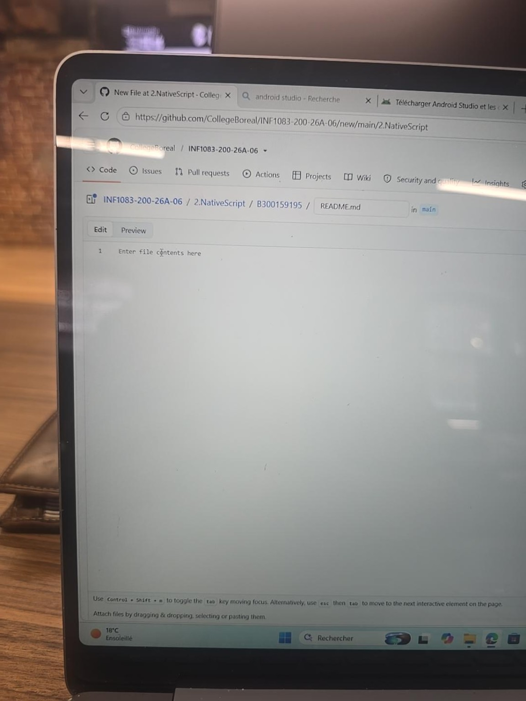

Dans `2.NativeScript`, la fonction **Add file → Create new file** permet de créer le dossier `B300159195` en saisissant `B300159195/README.md` comme chemin du nouveau fichier. Les captures doivent être placées sous `B300159195/captures/` pour que les liens relatifs de ce document fonctionnent sur GitHub.

### 24. Vérification du rendu publié

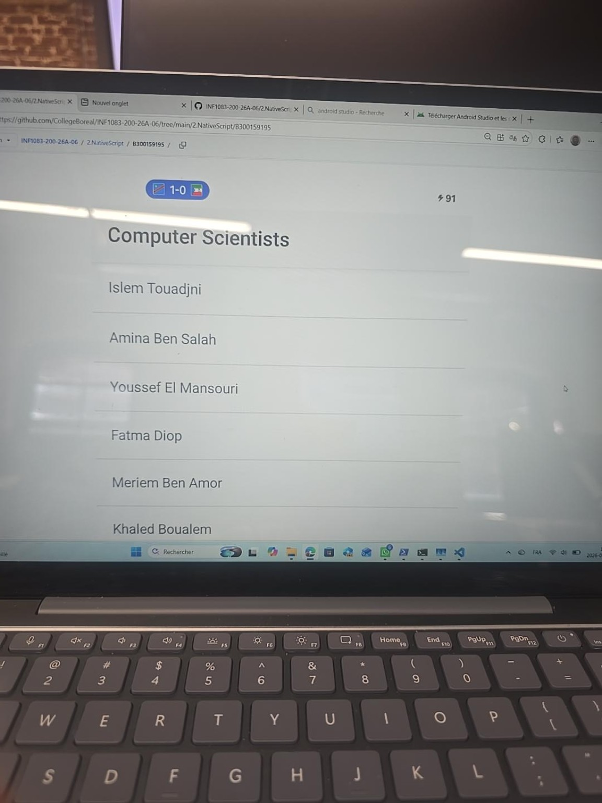

Le navigateur affiche le dossier personnel `2.NativeScript/B300159195` et la capture de l’application modifiée. Après dépôt du présent README et du dossier `captures`, vérifier que chaque photo s’affiche juste avant le paragraphe qui l’explique.

## Bilan des commandes utilisées

Les commandes `ns create B300159195` et `cd B300159195` ont été exécutées dans le terminal Windows (cmd dans les captures). Les commandes `ns doctor`, `ns run android`, `java -version`, `Test-Path` et `adb devices` ont également été utilisées durant le diagnostic et les essais ; la syntaxe avec `$env:` et `&` est propre à PowerShell. `npm install -g nativescript` installe la CLI. Les lignes « ns run ios », « ns debug android » et les commandes Ruby visibles sur la documentation d’autres étudiants ne sont pas des commandes exécutées pour ce projet Android.

## Résultat final

L’application est compilée et installée sur le téléphone Samsung. La liste initiale de scientifiques a été remplacée par quinze personnes aux noms transcrits en caractères latins. Les valeurs de pays et de profession sont dans le service ; l’écran de liste présente principalement les noms. Le titre « Computer Scientists » provient toujours du modèle initial.

## Conclusion

Ce travail a permis de créer un projet NativeScript Angular, de configurer les outils Android sur Windows, de contourner l’impossibilité d’utiliser l’émulateur en testant sur un téléphone réel, puis de résoudre une incompatibilité Java grâce au JDK 21. Après modification de `person.service.ts` et enregistrement dans VS Code, la nouvelle liste est apparue sur le téléphone. La compilation, l’installation sur l’appareil et la capture du résultat constituent les preuves de l’exécution réussie.
