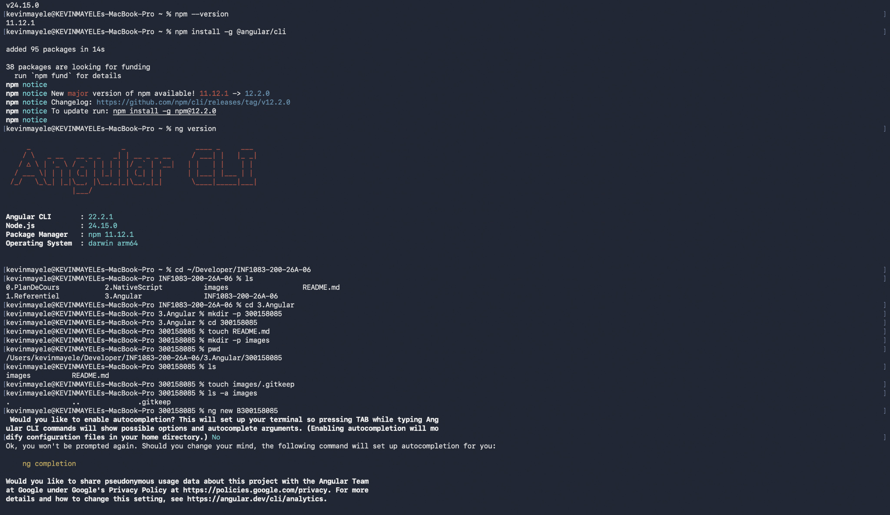
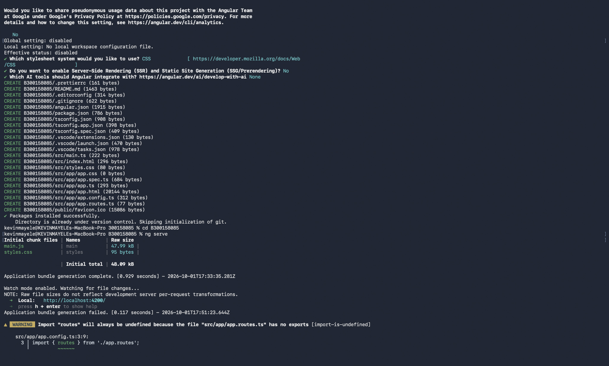
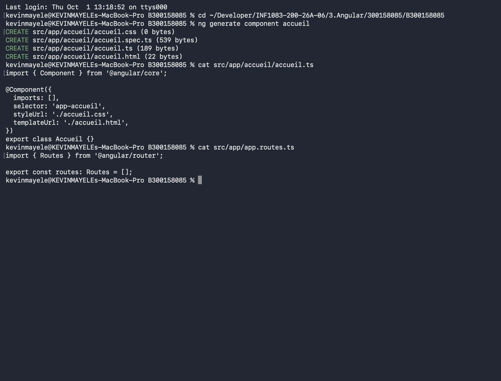
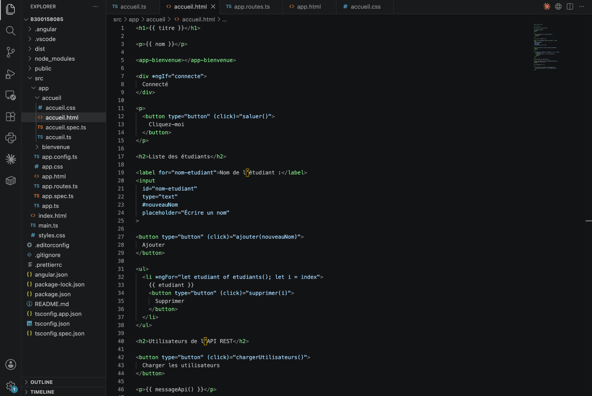
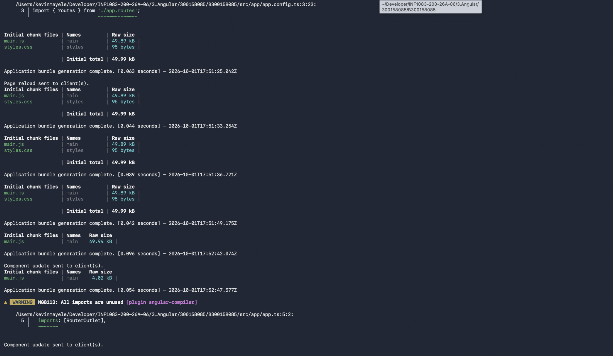
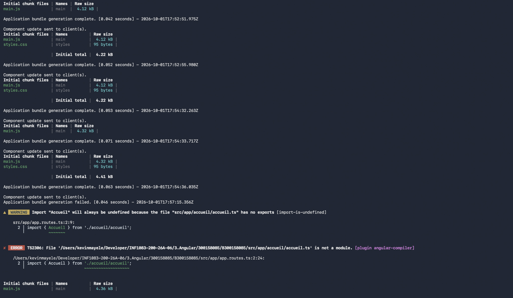
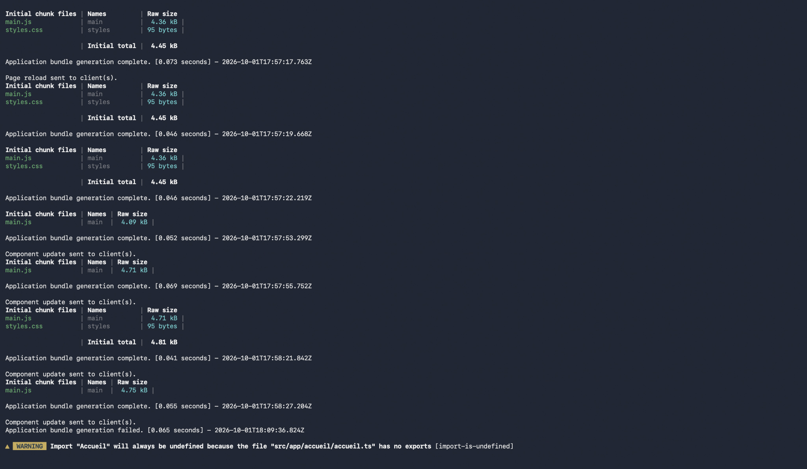
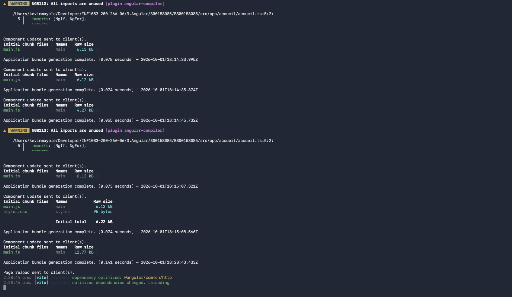
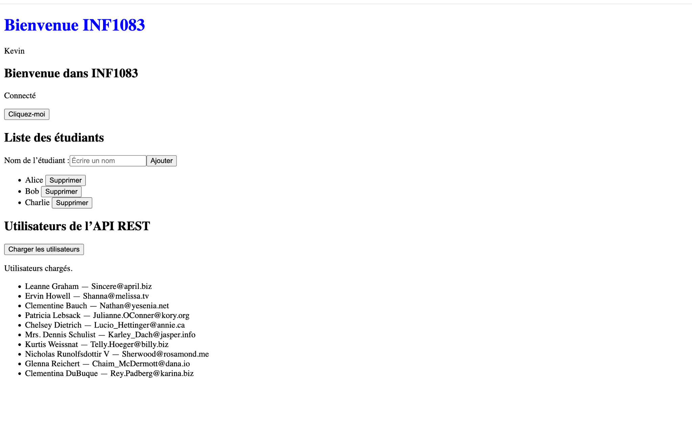

# Introduction à Angular

**Nom :** Kevin Mayele  
**Numéro étudiant :** 300158085  
**Cours :** INF1083  
**Projet :** B300158085  
**Environnement :** macOS  

## 1. Objectif du laboratoire

J’ai créé une application Angular pour pratiquer les composants, l’affichage des données, les événements, les directives, le routage, le CSS et la consommation d’une API REST.

Mon application permet d’afficher une liste d’étudiants, d’ajouter un étudiant, de supprimer un étudiant et de charger des utilisateurs depuis une API.

## 2. Vérification des outils

Node.js et npm étaient déjà installés sur mon Mac. J’ai vérifié leurs versions :

```bash
node --version
npm --version
```

Les versions affichées étaient :

| Outil | Version |
| --- | --- |
| Node.js | 24.15.0 |
| npm | 11.12.1 |
| Angular CLI | 22.2.1 |

J’ai installé Angular CLI, puis vérifié son installation :

```bash
npm install -g @angular/cli
ng version
```



## 3. Création de mon répertoire

Dans le dépôt du cours, j’ai créé mon dossier étudiant, le README et le dossier des captures :

```bash
cd ~/Developer/INF1083-200-26A-06/3.Angular
mkdir -p 300158085
cd 300158085
touch README.md
mkdir -p images
touch images/.gitkeep
```

Le fichier `.gitkeep` permet de conserver le dossier `images` dans Git lorsqu’il est vide.

## 4. Création du projet Angular

Depuis mon dossier étudiant, j’ai exécuté :

```bash
ng new B300158085
```

J’ai choisi les options suivantes :

| Option | Choix |
| --- | --- |
| Autocomplétion du terminal | No |
| Partage des données d’utilisation | No |
| Styles | CSS |
| SSR et SSG | No |
| Intégration d’outils d’intelligence artificielle | None |

Angular CLI a créé les fichiers et installé les dépendances.

J’ai ensuite lancé le serveur :

```bash
cd B300158085
ng serve
```

J’ai ouvert l’application à l’adresse :

```text
http://localhost:4200
```



## 5. Création du composant Accueil

Dans un deuxième terminal, depuis le dossier du projet, j’ai exécuté :

```bash
ng generate component accueil
```

Cette commande a créé les fichiers suivants dans `src/app/accueil` :

- `accueil.ts` : données et méthodes du composant ;
- `accueil.html` : contenu de l’interface ;
- `accueil.css` : styles du composant ;
- `accueil.spec.ts` : fichier de test généré.

Dans mon projet, les fichiers générés portent les noms `accueil.ts` et `app.ts`. J’ai utilisé ces noms plutôt que les noms `accueil.component.ts` et `app.component.ts` présentés dans le laboratoire.



## 6. Affichage des données

Dans la classe `Accueil`, j’ai ajouté les propriétés suivantes :

```typescript
titre = 'Bienvenue INF1083';
nom = 'Kevin';
connecte = true;
```

Dans le fichier HTML, j’ai utilisé :

```html
<h1>{{ titre }}</h1>
<p>{{ nom }}</p>
```

Les doubles accolades permettent d’afficher une valeur définie dans le fichier TypeScript. Le navigateur affiche donc le titre « Bienvenue INF1083 » et mon prénom « Kevin ».

J’ai aussi intégré un composant Bienvenue :

```html
<app-bienvenue></app-bienvenue>
```

Il affiche « Bienvenue dans INF1083 ».

## 7. Gestion d’un événement

J’ai ajouté un bouton qui appelle la méthode `saluer()` :

```html
<button type="button" (click)="saluer()">
  Cliquez-moi
</button>
```

La méthode affiche une alerte de salutation. La syntaxe `(click)` relie le clic de l’utilisateur à une méthode du composant.

## 8. Affichage conditionnel

J’ai utilisé `*ngIf` pour afficher un message lorsque `connecte` vaut `true` :

```html
<div *ngIf="connecte">
  Connecté
</div>
```

Cette partie illustre une condition d’affichage. Aucun système d’authentification n’a été créé.

## 9. Liste des étudiants

La liste initiale contient Alice, Bob et Charlie.

Dans le code final, la liste est conservée dans un signal. Sa valeur se lit avec `etudiants()`.

```html
<li *ngFor="let etudiant of etudiants(); let i = index">
  {{ etudiant }}
  <button type="button" (click)="supprimer(i)">
    Supprimer
  </button>
</li>
```

La directive `*ngFor` affiche un élément pour chaque étudiant. La variable `i` représente sa position dans la liste.

## 10. Ajout et suppression

J’ai ajouté un champ permettant de saisir un nom :

```html
<input
  id="nom-etudiant"
  type="text"
  #nouveauNom
  placeholder="Écrire un nom"
>

<button type="button" (click)="ajouter(nouveauNom)">
  Ajouter
</button>
```

La référence `#nouveauNom` permet de transmettre le champ à la méthode `ajouter`. Cette méthode vérifie le nom saisi et met à jour la liste.

Le bouton Supprimer appelle `supprimer(i)` pour retirer l’étudiant correspondant.

L’ajout et la suppression concernent la liste de l’application. Ils ne modifient pas les utilisateurs de l’API REST.



## 11. Routage

Dans `app.routes.ts`, j’ai associé la route d’accueil au composant `Accueil` :

```typescript
import { Routes } from '@angular/router';
import { Accueil } from './accueil/accueil';

export const routes: Routes = [
  { path: '', component: Accueil }
];
```

Dans `app.html`, j’ai placé :

```html
<router-outlet></router-outlet>
```

Angular affiche le composant de la route à cet emplacement. Mon application utilise une route d’accueil.

## 12. Style CSS

Dans `accueil.css`, j’ai ajouté :

```css
h1 {
  color: blue;
}
```

Le titre principal apparaît en bleu dans le navigateur.

## 13. API REST

J’ai configuré le client HTTP dans `app.config.ts` avec `provideHttpClient()`.

```typescript
import { ApplicationConfig } from '@angular/core';
import { provideRouter } from '@angular/router';
import { provideHttpClient } from '@angular/common/http';
import { routes } from './app.routes';

export const appConfig: ApplicationConfig = {
  providers: [
    provideRouter(routes),
    provideHttpClient()
  ]
};
```

Le bouton de chargement appelle la méthode `chargerUtilisateurs()` :

```html
<button type="button" (click)="chargerUtilisateurs()">
  Charger les utilisateurs
</button>
```

Cette méthode effectue une requête GET vers :

```text
https://jsonplaceholder.typicode.com/users
```

Les données reçues servent à afficher les noms et les adresses courriel des utilisateurs.

La capture finale montre le message « Utilisateurs chargés. » et dix utilisateurs. Une connexion Internet est nécessaire pour charger ces données.

## 14. Progression du développement

Les captures suivantes montrent les messages du serveur pendant les modifications.

### Compilation intermédiaire



### Erreur concernant Accueil

Pendant le développement, le terminal a affiché une erreur `TS2306` indiquant que `accueil.ts` n’était pas reconnu comme un module à cet instant.

La version utilisée ensuite contient la classe exportée `Accueil`, et l’application finale s’affiche correctement.



### Recompilation



### Rechargement du navigateur

Le serveur surveille les fichiers et transmet les mises à jour au navigateur. Certaines étapes montrent aussi un avertissement concernant `RouterOutlet`, lorsqu’il n’était pas utilisé dans le template.



## 15. Compilation et résultat final

Depuis le dossier `B300158085`, j’ai exécuté :

```bash
ng build
```

La compilation s’est terminée avec le message :

```text
Application bundle generation complete.
```

Le dossier de sortie annoncé était `dist/B300158085`.

La capture finale montre :

- le titre bleu « Bienvenue INF1083 » ;
- mon prénom Kevin ;
- le message du composant Bienvenue ;
- le texte « Connecté » ;
- le bouton de salutation ;
- le champ d’ajout d’un étudiant ;
- la liste des étudiants et les boutons Supprimer ;
- les dix utilisateurs chargés depuis l’API.



Les boutons d’ajout et de suppression sont visibles. Les actions elles-mêmes ne sont pas illustrées par des captures séparées.

## 16. Relancer l’application

Sur mon Mac, je peux relancer le projet avec :

```bash
cd ~/Developer/INF1083-200-26A-06/3.Angular/300158085/B300158085
ng serve
```

Puis ouvrir `http://localhost:4200`.

Pour arrêter le serveur, j’utilise `Ctrl + C` dans le terminal.

## 17. Bilan

Ce travail m’a permis de pratiquer les composants Angular, la liaison de données, les événements, les directives, le routage, les styles CSS et le client HTTP.

Le projet réalisé est `B300158085`. La compilation a réussi. Les fichiers de test ont été générés, mais je ne présente pas de résultat d’exécution de tests automatisés.
